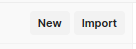

# IRAISE MICROSEVICE
Proyek tugas akhir yang mengimplementasikan sistem backend berfokus pada otentikasi dan otentikasi dengan mengambil studi kasus alur bisnis dan peran-peran yang ada pada website Iraise UIN Suska Riau.

**Teknologi & Konsep Utama**
- **Manajemen Identitas dan Akses** yang terpusat menggunakan Keycloak sebagai solusi Identity and Access Management (IAM).
- **Kontrol Access Berbasis Peran (RBAC)** untuk mengelola hak akses pengguna.
- **Pengujian otomatis** menggunakan fitur automated testing **POSTMAN**, untuk menguji manajement otentikasi dan otorisasi terhadat tiap Endpoint.

## Daftar Isi
* [Desain RBAC](#desain-rbac)
* [Desain Sistem](#desain-sistem)
* [Panduan Instalasi & Requirement](#panduan-instalasi--requirement)
* [Kontak](#kontak)


## Desain RBAC

Berdasarkan wawancara dengan pihak akademik dan program studi Teknik Informatika, dirancanglah hirarki peran dalam sistem seperti yang diilustrasikan pada gambar berikut:


### Deskripsi Peran Pengguna (Roles)

Berikut adalah deskripsi dan tanggung jawab untuk setiap peran yang didefinisikan dalam sistem.

| Peran                  | Deskripsi Singkat                                                                                                 | Contoh Hak Akses                                                                                                          |
|:-----------------------|:------------------------------------------------------------------------------------------------------------------|:--------------------------------------------------------------------------------------------------------------------------|
| **Admin Akademik**     | Peran dengan hak akses tertinggi (superuser). Dapat mengelola seluruh data akademik dan peran pengguna lain.      | Mengelola semua akun Iraise. Mengelola data kurikulum. Mengakses semua menu dan laporan yang tersedia.                    |
| **Admin Layanan Cuti** | Staf administrasi akademik yang khusus menangani pengajuan cuti akademik mahasiswa.                               | Memproses dan menyetujui/menolak pengajuan cuti oleh mahasiswa.                                                           |
| **Admin Layanan**      | Staf administrasi akademik yang menangani layanan umum akademik.                                                  | Memverifikasi data pendaftaran. Mengelola surat keterangan mahasiswa. Memproses/memverifikasi pengajuan wisuda mahasiswa. |
| **Admin Prodi**        | Administrator yang bertanggung jawab atas data spesifik suatu Program Studi (Prodi).                              | Mengatur kelas/jadwal perkuliahan per semester. Mengelola data mahasiswa untuk prodi. Mengelola data dosen prodi.         |
| **Prodi**              | Peran yang dimiliki oleh pimpinan prodi (ketua/wakil prodi). Khusus memantau/melihat/mengkoreksi data-data prodi. | Melihat dan mengkoreksi data jadwal/kelas perkuliahan, data mahasiswa prodi, dosen prodi.                                 |
| **Dosen**              | Tenaga pengajar yang memiliki akses terkait kegiatan perkuliahan, absen, penilaian dan bimbingan mahasiswa.       | Mengisi nilai. Melihat daftar mahasiswa di kelasnya. Membuka/menutup sesi perkuliahan/bimbingan.                          |
| **Mahasiswa**          | Pengguna sistem yang merupakan mahasiswa aktif.                                                                   | Mengisi KRS, melihat transkrip nilai, mengajukan cuti, melihat jadwal, mengajukan wisuda.                                 |
| **Guest**              | Pengguna yang tidak terotentikasi.                                                                                | Hanya dapat melihat informasi publik yang tersedia di halaman depan/halaman login.                                        |


## Desain Sistem

Arsitektur mikroservice merupakan arsitektur yang membagi sistem yang satu(monolith) menjadi bagian-bagian kecil (microservice) yang biasanya pembagiannya dikelompokkan berdasarkan alur bisnisnya. Dari pemetaan peran dan tugas pada studi kasus Iraise, sistem ini dibagi menjadi beberapa microservice seperti yang diilustrasikan pada gambar berikut.


### Deskripsi Desain Microservice

Berikut adalah deskripsi dan peran bisnis dari tiap-tiap microservice yang telah didefinisikan di atas:

| Servis/Node                                                | Deskripsi Fungsi Singkat                                                                                                                                                                                                                                                                                                                         | 
|:-----------------------------------------------------------|:-------------------------------------------------------------------------------------------------------------------------------------------------------------------------------------------------------------------------------------------------------------------------------------------------------------------------------------------------|
| **Client**                                                 | Sistem atau Aplikasi yang melakukan permintaan/request ke sistem Backend.                                                                                                                                                                                                                                                                        |
| **Keycloak**                                               | Service yang mengelola data akun pengguna, dan peran yang tersedia. Service Keycloak juga bertanggung jawab menerbitkan token JSON Web Token (JWT) sebagai token yang memiliki informasi otentikasi dan hak akses (roles) pengguna, serta service yang melakukan verifikasi validitas dari token JWT yang disertakan dalam permintaan (request). |
| **API Gateway**                                            | Service yang bertindak sebagai gerbang utama masuknya semua request dari client dan meneruskanya ke service sesuai. Selain itu service ini juga akan menvalidasi status otentikasi dari setiap request.                                                                                                                                          |
| **Communication and Support Service**                      | Mengelola permintaan seputar informasi dan layanan Akademik.                                                                                                                                                                                                                                                                                     |
| **Academic Affairs and Administration Management Service** | Mengelola permintaan seputar urusan akademik seperti mengelola cuti, mengelola wisuda, mengelola kalender akademik, dll.                                                                                                                                                                                                                         |
| **User and Identity Management Service**                   | Mengelola permintaan seputar manajemen akun seperti membuat/mengelola akun Iraise, profil akun, dan log/pencatatan aktifitas pengguna.                                                                                                                                                                                                           |
| **Academic Course and Curriculum  Management Service**     | Mengelola permintaan seputar kurikulum, matakuliah, kelas, jadwal kuliah.                                                                                                                                                                                                                                                                        |
| **Student and Lecturer Management Service**                | Mengelola permintaan seputar data mahasiswa dan dosen.                                                                                                                                                                                                                                                                                           |
| **Academic Performance and Assessment Service**            | Mengelola permintaan seputar penilaian mahasiswa, transkrip mahasiswa, ipk mahasiswa, grafik perkuliahan mahasiswa prodi, absensi kelas.                                                                                                                                                                                                         |

## Panduan Instalasi & Requirement

Untuk menginstall sistem ini ada beberapa persyaratan, requirement yang harus dipenuhi/diinstall, yaitu:
* Docker & Docker Compose
* Postman
* Akses ke Terminal

### Instalasi

1. **Clone Repository**:
    ```bash
    git clone https://github.com/abdullahfikri/iraise-microservice.git && cd iraise-microservice
    ```
2. **Jalankan aplikasi dengan Docker Compose**
    ```bash
    docker compose up #or docker-compose up
    ```
   *Pastikan port 8085, 8761, 8011, 8100, 8110, 8120, 8130, 8090, dan 8765 tidak digunakan karena akan digunakan oleh aplikasi ini.

3. Menjalankan Tes Otomatis dengan Postman
   
   Pengujian hanya berupa menguji apakah client yang sedang melakukan permintaan ke Enpoint memilihi hak akses atau tidak, jika client memiliki hak akses maka sistem akan mengembalikan kode http **200**, jika tidak akan mengembalikan kode http **403**, dan jika terdeteksi tidak terotentikasi akan mengembalikan kode http **401**. Berikut adalah langkah-langkat menjalankan tes otomatis menggunakan postman:
   - Buka postman, klik tombol **Import** di pojok kiri atas, lalu drag dan drop file **iraise.postman_environment.json** dan **iraise-keycloak-microservice.postman_collection.json** yang ada pada folder iraise-microservice.
   
     
   - **Aktifkan environment** dengan klik di pojok kanan atas jendela Postman, pilih environment **iraise** yang baru saja di-Import.
   
     
   - Jalankan testing dengan klik tombol **Run** di pojok kanan atas, lalu klik **RUN iraise-keycloak-microservice**
   
     

Berikut adalah hasil pengujian yang dijalankan:


## Kontak

Muhammad Fikri - [LinkedIn](www.linkedin.com/in/mfikridevapp) - mfikri.dev@gmail.com

Link Proyek: [iraise-microservice](https://github.com/abdullahfikri/iraise-microservice)
